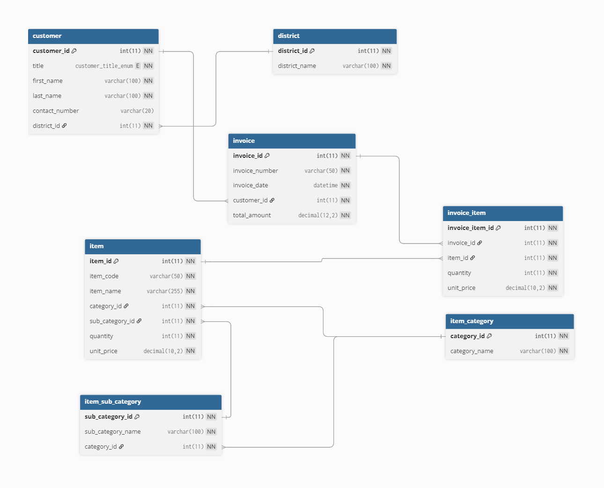

# CSQUARE ERP System - Intern Assignment


# How-to setup project in a local environment.

Install **XAMPP** (or WAMP/MAMP) which includes:
- PHP
- MySQL
- Apache Server

### Installation Steps

#### Step 1: Get the Project
```bash
# Clone the repository
git clone https://github.com/ManjanaAloka/csquare.git

# OR download and extract the ZIP file
```

#### Step 2: Place Project in Server Directory
- Move the `csquare` folder to your web server directory:
  - **XAMPP**: `C:\xampp\htdocs\csquare`
  - **WAMP**: `C:\wamp\www\csquare`
  - **MAMP**: `/Applications/MAMP/htdocs/csquare`

#### Step 3: Start Services
1. Open **XAMPP Control Panel**
2. Start **Apache** and **MySQL** services

#### Step 4: Create Database
1. Open browser and go to: `http://localhost/phpmyadmin`
2. Click **"New"** to create a database
3. Name it: `csquare`
4. Click **"Create"**

#### Step 5: Import Database
1. Select the `csquare` database you just created
2. Click the **"Import"** tab
3. Click **"Choose File"** and select: `database/csquare.sql`
4. Click **"Go"** at the bottom
5. Wait for the import to complete

#### Step 6: Configure Database Connection
1. Open `controllers/conn.php` in a text editor
2. Verify the connection settings (usually these are correct for XAMPP):
   ```php
   $servername = "localhost";
   $username = "root";
   $password = "";           // Empty by default in XAMPP
   $database = "csquare";
   ```
3. Save the file

#### Step 7: Run the Application
1. Open your browser
2. Navigate to: `http://localhost/csquare/index.php`
3. You should see the CSQUARE ERP System!


-------------------------------------------------------------------------------------------------------------------------


//---------------- Overall Information ----------------------

## Technology Stack

* **Backend:** PHP
* **Database:** MySQL
* **Frontend:** HTML5, Bootstrap 5, CSS3
* **Scripting:** JavaScript (with jQuery & AJAX)
* **Server:** Apache (via XAMPP)

## How to Set Up and Run in a Local Environment

### Prerequisites

Install **XAMPP** (or WAMP/MAMP) which includes:
- PHP
- MySQL
- Apache Server

### Installation Steps

#### Step 1: Get the Project
```bash
# Clone the repository
git clone https://github.com/ManjanaAloka/csquare.git

# OR download and extract the ZIP file
```

#### Step 2: Place Project in Server Directory
- Move the `csquare` folder to your web server directory:
  - **XAMPP**: `C:\xampp\htdocs\csquare`
  - **WAMP**: `C:\wamp\www\csquare`
  - **MAMP**: `/Applications/MAMP/htdocs/csquare`

#### Step 3: Start Services
1. Open **XAMPP Control Panel**
2. Start **Apache** and **MySQL** services

#### Step 4: Create Database
1. Open browser and go to: `http://localhost/phpmyadmin`
2. Click **"New"** to create a database
3. Name it: `csquare`
4. Click **"Create"**

#### Step 5: Import Database
1. Select the `csquare` database you just created
2. Click the **"Import"** tab
3. Click **"Choose File"** and select: `database/csquare.sql`
4. Click **"Go"** at the bottom
5. Wait for the import to complete

#### Step 6: Configure Database Connection
1. Open `controllers/conn.php` in a text editor
2. Verify the connection settings (usually these are correct for XAMPP):
   ```php
   $servername = "localhost";
   $username = "root";
   $password = "";           // Empty by default in XAMPP
   $database = "csquare";
   ```
3. Save the file

#### Step 7: Run the Application
1. Open your browser
2. Navigate to: `http://localhost/csquare/index.php`
3. You should see the CSQUARE ERP System!

### Quick Access URLs

- **Main Page**: `http://localhost/csquare/index.php`
- **Customers**: `http://localhost/csquare/index.php?page=customers`
- **Items**: `http://localhost/csquare/index.php?page=items`
- **Reports**: `http://localhost/csquare/index.php?page=reports`

### Database Schema

<p align="center">
<a href="database/ER_Diagram.png">

</a>
</p>

The database consists of 7 tables:

1. **`district`** - Reference table for districts
2. **`customer`** - Customer master data
3. **`item_category`** - Item categories
4. **`item_sub_category`** - Item subcategories (linked to categories)
5. **`item`** - Item master data with stock quantities
6. **`invoice`** - Invoice headers
7. **`invoice_item`** - Invoice line items

**Table Relationships:**
- `customer` → `district` (Many-to-One)
- `item` → `item_category` (Many-to-One)
- `item` → `item_sub_category` (Many-to-One)
- `invoice` → `customer` (Many-to-One)
- `invoice_item` → `invoice` (Many-to-One)
- `invoice_item` → `item` (Many-to-One)


## Project Architecture

### Architecture Overview

The CSQUARE ERP System follows a **component-based MVC-inspired architecture** with a clear separation between presentation, business logic, and data layers. The application uses a **single-page application (SPA) approach** with AJAX for seamless user interactions.

### Architecture Pattern

The project implements a **layered architecture** pattern:

```
┌─────────────────────────────────────┐
│     Presentation Layer (Frontend)   │
│  - Components (Views)               │
│  - JavaScript (AJAX Handlers)       │
│  - CSS (Styling)                    │
└──────────────┬──────────────────────┘
               │
┌──────────────▼──────────────────────┐
│     Routing Layer                   │
│  - routes/index.php                 │
└──────────────┬──────────────────────┘
               │
┌──────────────▼──────────────────────┐
│     Business Logic Layer (Backend)  │
│  - Controllers (API Endpoints)      │
└──────────────┬──────────────────────┘
               │
┌──────────────▼──────────────────────┐
│     Data Access Layer               │
│  - Database Connection              │
│  - MySQL Database                   │
└─────────────────────────────────────┘
```

### Directory Structure

```
csquare/
│
├── index.php                 # Main entry point - loads routing
├── README.md                 # Project documentation
│
├── routes/                   # Routing Layer
│   └── index.php            # URL routing based on query parameters
│
├── components/               # Presentation Layer (Views)
│   ├── header.php           # Navigation bar component
│   ├── customer.php         # Customer management UI
│   ├── item.php             # Item management UI
│   └── report.php           # Reports UI
│
├── controllers/              # Business Logic Layer (API)
│   ├── conn.php             # Database connection handler
│   ├── customer.php         # Customer CRUD operations API
│   ├── item.php             # Item CRUD operations API
│   └── report.php           # Report generation API
│
├── assets/                   # Static Assets
│   ├── css/
│   │   └── styles.css       # Custom styles
│   └── js/
│       └── ajax/
│           ├── customer.js  # Customer AJAX handlers
│           ├── item.js      # Item AJAX handlers
│           └── report.js    # Report AJAX handlers
│
└── database/                 # Database Files
    ├── csquare.sql          # Database schema and sample data
    └── ER_Diagram.png       # Entity Relationship Diagram
```

### Request Flow

1. **User Request Flow:**
   ```
   Browser Request → index.php → routes/index.php → components/*.php
   ```

2. **AJAX Request Flow:**
   ```
   JavaScript (AJAX) → controllers/*.php → Database → JSON Response → UI Update
   ```


### Component Details

#### 1. **Entry Point (`index.php`)**
- Single entry point for the application
- Loads Bootstrap 5, jQuery, and Font Awesome via CDN
- Includes the routing system

#### 2. **Routing System (`routes/index.php`)**
- Handles URL-based routing using query parameter `?page=`
- Routes to appropriate components:
  - `?page=customers` → `components/customer.php`
  - `?page=items` → `components/item.php`
  - `?page=reports` → `components/report.php`
- Includes navigation header on all pages
- Sets active navigation state

#### 3. **Components (Views)**
- **`components/header.php`**: Responsive navigation bar with Bootstrap 5
- **`components/customer.php`**: Customer CRUD interface with modals
- **`components/item.php`**: Item CRUD interface with dynamic dropdowns
- **`components/report.php`**: Report generation interface with tabs

#### 4. **Controllers (API Endpoints)**

- **`controllers/conn.php`**: 
  - Establishes MySQL database connection
  - Singleton pattern for connection reuse

- **`controllers/customer.php`**: 
  - Actions: `get_customers`, `get_customer`, `get_districts`, `save_customer`, `delete_customer`
  - Returns JSON responses

- **`controllers/item.php`**: 
  - Actions: `get_items`, `get_item`, `get_categories`, `get_sub_categories`, `save_item`, `delete_item`
  - Handles dynamic category/subcategory relationships

- **`controllers/report.php`**: 
  - Actions: `report_invoice`, `report_invoice_item`, `report_item_stock`
  - Generates date-filtered reports

#### 5. **Frontend JavaScript**
  - **`assets/js/ajax/customer.js`**: Handles all customer-related AJAX calls
  - **`assets/js/ajax/item.js`**: Handles item operations and dynamic dropdowns
  - **`assets/js/ajax/report.js`**: Handles report generation and date filtering


### Design Patterns Used
  1. **Action-Based Controller Pattern**: Each controller handles multiple actions via switch statements
  2. **Component Pattern**: Reusable UI components (header, forms, tables)
  3. **Singleton Pattern**: Database connection reuse
  4. **Separation of Concerns**: Clear separation between presentation, logic, and data layers

### API Response Format
All controllers return consistent JSON responses:

**Success Response:**
```json
{
    "success": true,
    "data": [...],
    "message": "Operation successful"
}
```

## Assumptions Made
    As requested, here are the assumptions made during development:

   1.  **Architecture:** The project uses separate controller files (`customer.php`, `item.php`, `report.php`) organized by domain/feature rather than a single monolithic API file.
   2.  **Form Validation:** Validation is implemented on the frontend using HTML5's `required` attribute and Bootstrap's validation styles.
   3.  **Routing:** Simple query parameter-based routing (`?page=`) is used instead of URL rewriting or a routing framework.
   4.  **Database:** MySQL database is accessed via MySQLi extension with direct SQL queries (no ORM).
   5.  **Security:** For development/demo purposes, basic error reporting is disabled (`error_reporting(0)`).


## Contributors / Authors
    Developed by: Y.K.M. Aloka  
    University of Vocational Technology, Sri Lanka
    E-mail: manjanaaloka997@gmail.com